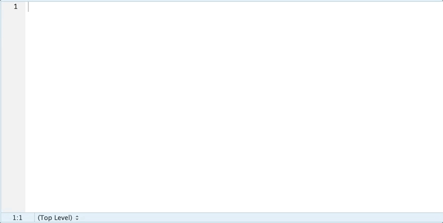
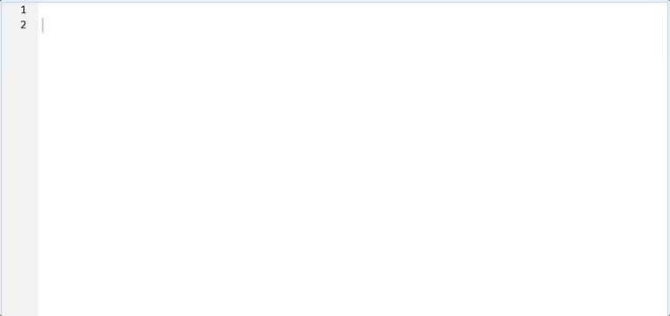

# texsnippets

Add `RStudio` snippets for boilerplate TeX commands

## Installation

```r
remotes::install_github('yonicd/texsnippets')
```

## Setup

To set up the snippets in RStudio run (after running it you must restart the Rstudio IDE)

```r
texsnippets::add_snippets()
```

## Usage

All snippets have a ts (texsnippets) prefix. Write `'ts'` in the `RStudio` source editor and press `tab` button.

## Examples

### Boiler plate snippets



### Snippets that wrap around lines of text



### Single Lines
```
ts_{caption}
ts_{label}
ts_{usepackage}
ts_{usepackage}[options]
```


### Begin\End

```
ts_{abstract}
ts_{alltt}
ts_{array}{cols}
ts_{array}[pos]{cols}
ts_{bmatrix}
ts_{Bmatrix}
ts_{center}
ts_{description}
ts_{description}\item
ts_{displaymath}
ts_{document}
ts_{enumerate}\item
ts_{equation}
ts_{eqnarray}
ts_{figure}
ts_{figure}[placement]
ts_{figure*}
ts_{figure*}[placement]
ts_{filecontents}
ts_{filecontents*}
ts_{flushleft}
ts_{flushright}
ts_{footnotesize}
ts_{Huge}
ts_{huge}
ts_{itemize}
ts_{itemize}\item
ts_{LARGE}
ts_{Large}
ts_{large}
ts_{list}{label}{spacing}
ts_{lrbox}
ts_{math}
ts_{matrix}
ts_{minipage}[position]{width}
ts_{minipage}{width}
ts_{normalsize}
ts_{picture}(width,height)
ts_{picture}(width,height)(xoffset,yoffset)
ts_{pmatrix}
ts_{quotation}
ts_{quote}
ts_{scriptsize}
ts_{small}
ts_{tabbing}
ts_{table*}
ts_{table*}[placement]
ts_{table}
ts_{table}[placement]
ts_{tabular}{cols}
ts_{tabular}[pos]{cols}
ts_{tabular*}{width}[pos]{cols}
ts_{tabular*}{width}{cols}
ts_{thebibliography}{widestlabel}
ts_{theindex}
ts_{theorem}
ts_{theorem}[optional]
ts_{tiny}
ts_{titlepage}
ts_{trivlist}
ts_{verbatim}
ts_{verbatim*}
ts_{Vmatrix}
ts_{vmatrix}
ts_{verse}
```

### Wizards

Templates of combinations of commands

```
ts_wizard_{table}

	\begin{table}
		\label{label}
		\caption{caption}
		\begin{tabular}

		\end{tabular}
	\end{table}

ts_wizard_{table}[placement]{width}[pos]{cols}

	\begin{table}[placement]
		\label{label}
		\caption{caption}
		\begin{tabular}{width}[pos]{cols}

		\end{tabular}
	\end{table}

ts_wizard_{table}[placement]

	\begin{table}[placement]
		\label{label}
		\caption{caption}
		\begin{tabular}

		\end{tabular}
	\end{table}

ts_wizard_{table}{width}[pos]{cols}

	\begin{table}
		\label{label}
		\caption{caption}
		\begin{tabular}{width}[pos]{cols}

		\end{tabular}
	\end{table}

```
